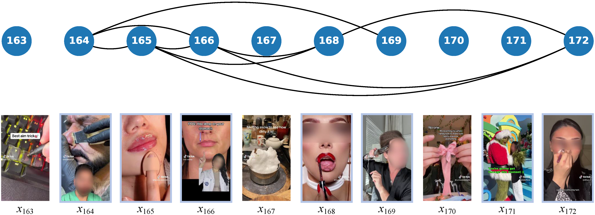

# ClipMind: A Framework for Auditing Short-Format Video Recommendations Using Multimodal AI Models

[Aoyu Gong](https://aygong.com/), [Sepehr Mousavi](https://sepehrmousavi.github.io/), [Yiting Xia](https://sites.google.com/view/yitingxia/), [Savvas Zannettou](https://zsavvas.github.io/)


[[Paper](https://ojs.aaai.org/index.php/ICWSM/article/view/35838)] [[Slides](https://aygong.com/docu/icwsm25slides.pdf)] [[Citation](https://ojs.aaai.org/index.php/ICWSM/citationstylelanguage/download/bibtex?submissionId=35838&publicationId=34111)]


## 🧭 Overview

<div align="center">
<p>

</p>
</div>

This repository contains the code for our paper: 
> ClipMind: A Framework for Auditing Short-Format Video Recommendations Using Multimodal AI Models


## 🔧 Environment Setup

> 💡 If you have Conda installed, you may skip this section and proceed to the next one.

Follow these steps to set up a reproducible environment:

### 1. Download Miniforge (Conda Installer)
```bash
wget https://github.com/conda-forge/miniforge/releases/download/24.11.0-0/Miniforge3-24.11.0-0-Linux-x86_64.sh
```

### 2. Install Miniforge
```bash
bash Miniforge3-24.11.0-0-Linux-x86_64.sh -b -p ~/miniforge3
```

### 3. Initialize Conda
```bash
~/miniforge3/bin/conda init bash
source ~/.bashrc
```

To ensure Conda is initialized in login shells, add the following to `~/.bash_profile`:
```bash
echo 'source ~/.bashrc' >> ~/.bash_profile
```

If `~/.bash_profile` already exists, make sure it includes this line:
```bash
source ~/.bashrc
```

### 4. Verify Conda installation:
```bash
conda --version
```


## 🏗️ Create Environment and Install Dependencies

### 1. Create the Conda Environment
```bash
conda env create -f environment.yml
```

### 2. Activate the Conda Environment
```bash
conda activate clipmind
```

### 3. Install PyTorch with CUDA Support
```bash
pip install torch==1.13.1 torchvision==0.14.1 torchaudio==0.13.1 --extra-index-url https://download.pytorch.org/whl/cu117
```

### 4. Install Additional Tools (ffmpeg and git-lfs)
```bash
conda install -c conda-forge ffmpeg=4.3.1 git-lfs
```
> 💡 FFmpeg version 4 is required for compatibility.


## ⚙️ Edit Configuration

Update the following fields:
- `openai.api_key`: Insert your OpenAI API key.
- `working_trace`: Path to your short-format video trace directory.

> 💡 A default `test` trace is provided for demonstration purposes.


## 📂 Add Your Own Trace

To analyze your short-format video traces, organize your data using the following folder structure:
```
./ClipMind/
└── data/
    └── your_trace_name/
        ├── metadata/           # Video metadata
        ├── videos/             # Video files
        └── viewing.json        # A JSON file with timestamped viewing history
```

> 💡 A default `test` trace is provided for demonstration purposes.


## 🔁 Two-Phase Workflow

The `working_trace` field in `configuration.yaml` specifies the active data directory used by the framework.

- **Phase 1 – Calibration Trace**:
  Start by setting `working_trace` to a trace you want to use for sampling and annotation. This trace is used to identify the best feature combination and similarity threshold.
  After running the notebook `identify_best_features_threshold.ipynb`, the best parameters will be written back into `configuration.yaml`.

- **Phase 2 – Analysis Traces**:
  You can now switch `working_trace` to other traces you wish to analyze. The notebook `video_sequence_analysis.ipynb` will apply the identified parameters to auditing short-format video recommendations in those traces.


## 🚀 Running the Framework

The following list outlines the recommended notebook execution order across the two phases:

1. `setup.ipynb`
2. `convert_video_to_audio.ipynb`
3. `llm_generated_description.ipynb`
4. `user_defined_metadata.ipynb`
5. `llm_generated_keywords.ipynb`
6. `text_embedding.ipynb`
7. `sampling.ipynb`
8. `annotation.ipynb`
10. `identify_best_features_threshold.ipynb`
11. `video_sequence_analysis.ipynb`

> 💡 Use Jupyter or VSCode to execute notebooks interactively.

For the two phases, run different subsets of notebooks depending on whether you are identifying the best parameters or analyzing new traces: 
- **Prepare AI Models**:
  Run notebook 1
- **Phase 1 – Calibration Trace**:
  Run notebooks 2 $\to$ 9
- **Phase 2 – Analysis Traces**:
  Run notebooks 2 $\to$ 6 (prepare embeddings), then notebook 10 (analyze new traces)

## 📄 Citation

If you find the codebase helpful, please consider giving a ⭐ and citing our paper:
```bibtex
@inproceedings{gong2025clipmind,
  title={ClipMind: A Framework for Auditing Short-Format Video Recommendations Using Multimodal AI Models},
  author={Gong, Aoyu and Mousavi, Sepehr and Xia, Yiting and Zannettou, Savvas},
  booktitle={Proceedings of the International AAAI Conference on Web and Social Media},
  volume={19},
  pages={671--687},
  year={2025}
}
```


## 😋 Questions or Issues?

If you run into problems or have suggestions, feel free to open an issue or reach out to us.